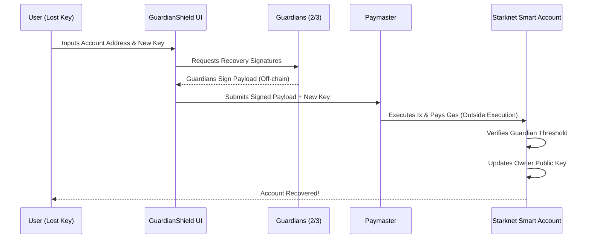

# 🛡️ GuardianShield
### *Gasless Social Recovery for the Next Billion Users*

[](https://starknet.io)
[](https://www.cairo-lang.org/)
[](https://react.dev/)

## Demo Video

[](https://www.youtube.com/watch?v=HD68O9LAw0k)

---

## 📖 Overview
**GuardianShield** is a decentralized, fully gasless social recovery hub. It completely eliminates "seed phrase anxiety" by allowing users to recover their Starknet smart accounts through a trusted circle of Guardians (friends, family, or hardware devices).

Because of Starknet's **Native Account Abstraction**, GuardianShield doesn't just send notifications—it acts as a programmable vault. Best of all, if a user loses their keys, they usually don't have the crypto to pay for a recovery transaction. GuardianShield solves this by integrating **Paymasters**, ensuring the recovery process is 100% gasless for both the user and the Guardians.

## 🛑 The Problem
* **The Seed Phrase Bottleneck:** "Normies" hate writing down 24 words, and hardware wallets get lost or destroyed.
* **The Gas Catch-22:** If you lose your wallet, you can't pay the gas fees required to execute a smart-contract recovery.
* **Clunky UX:** Existing recovery solutions feel like using a database from the 1990s. 

## ✨ The Solution: Starknet Native AA
* **Threshold Signatures:** The smart account requires $M$ out of $N$ Guardians to sign a recovery payload to rotate the owner's public key.
* **Sponsored Transactions:** The frontend routes the recovery transaction through a Starknet Paymaster. The Guardians just click "Sign," and the protocol handles the gas.
* **Apple-Grade UX:** A sleek, glassmorphism UI that feels like recovering an iCloud password, not interacting with a blockchain.

---

## ⚙️ Architecture & Workflow



## 🛠️ Tech Stack
Smart Contracts: Cairo (Starknet Foundry & Scarb)

Frontend: React, Tailwind CSS, Framer Motion, Lucide Icons

Blockchain Interaction: Starknet.js, @starknet-react/core

Gas Sponsorship: AVNU / OpenZeppelin Paymaster architecture

## 🚀 Getting Started
Prerequisites

Scarb (Cairo package manager)

Node.js (v18+)

## 1. Smart Contracts
Bash
Clone the repository
```bash git clone [https://github.com/TeresiaMkarie/Proof-Of-Life.git](https://github.com/TeresiaMkarie/Proof-Of-Life.git)

cd proof-of-life/contract

# Build the Cairo contracts
scarb build

# Run tests
snforge test
```

## 2. Frontend App

```Bash
# Navigate to the frontend directory
cd ../client

# Install dependencies
npm install

# Start the development server
npm run dev
```

## 🗺️ Roadmap
[ ] Hardware Enclave Support: Allow a user's FaceID/TouchID (secp256r1 curve) to act as a Guardian natively on-chain.

[ ] Time-Locked Recovery: Introduce a 48-hour delay on key rotation to prevent malicious Guardian collusion.

[ ] Guardian Rotation: Gasless UX for adding or removing Guardians over time.

## 🤝 Contributing
Built with ⚡ during the Starknet Hackathon 2026.